# Results Table

| Hidden Layers | Learning Rate | Final Loss | Final Accuracy | Test Accuracy | Execution Time | Results Plot                                              |
| ------------- | ------------- | ---------- | -------------- | ------------- | -------------- | --------------------------------------------------------- |
| (160, 100)    | 1.0           | 2.5155     | 0.0997         | 0.1138        | 1089.14 sec    | 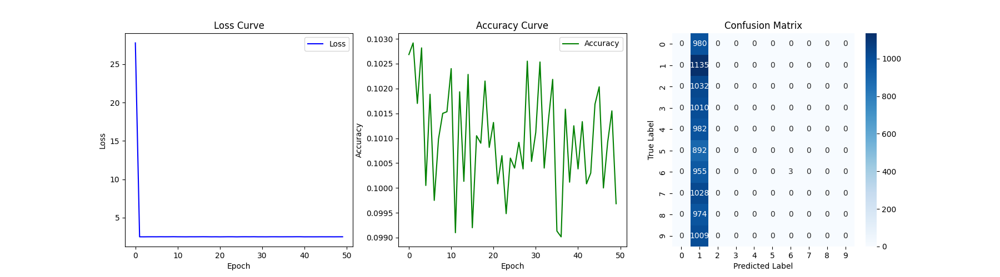         |
| (100, 160)    | 1.0           | 2.5160     | 0.1007         | 0.0892        | 1415.41 sec    | 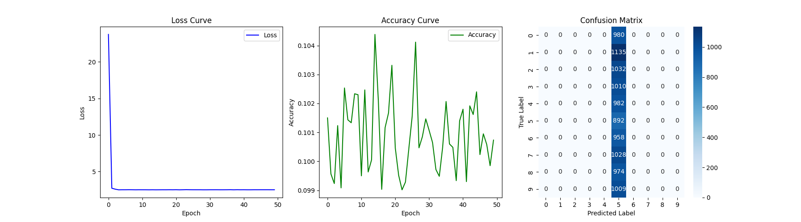         |
| (100, 100)    | 1.0           | 2.5104     | 0.1004         | 0.1032        | 1196.19 sec    | 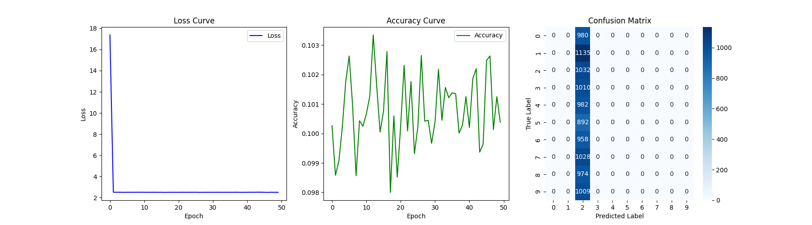         |
| (100, 60)     | 1.0           | 2.5100     | 0.1019         | 0.0974        | 1210.12 sec    | 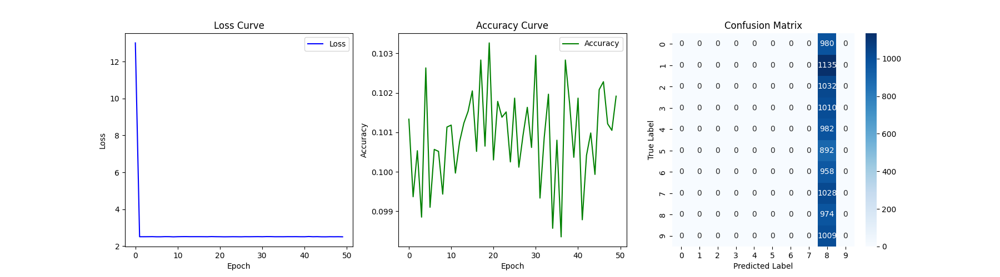          |
| (60, 60)      | 1.0           | 2.5186     | 0.0999         | 0.0892        | 1180.06 sec    | 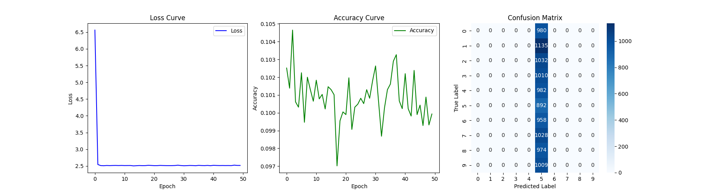           |
| (160, 100)    | 0.1           | 2.3244     | 0.1013         | 0.1028        | 1019.41 sec    | 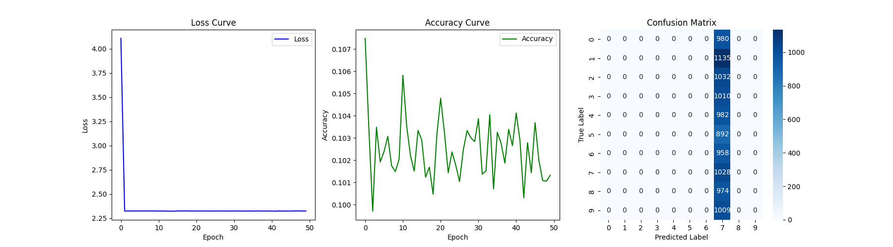     |
| (100, 160)    | 0.1           | 2.3254     | 0.1004         | 0.0974        | 1359.08 sec    | 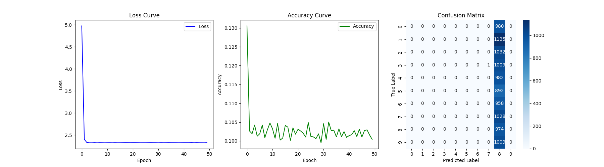     |
| (100, 100)    | 0.1           | 2.3246     | 0.1008         | 0.0980        | 1117.01 sec    | 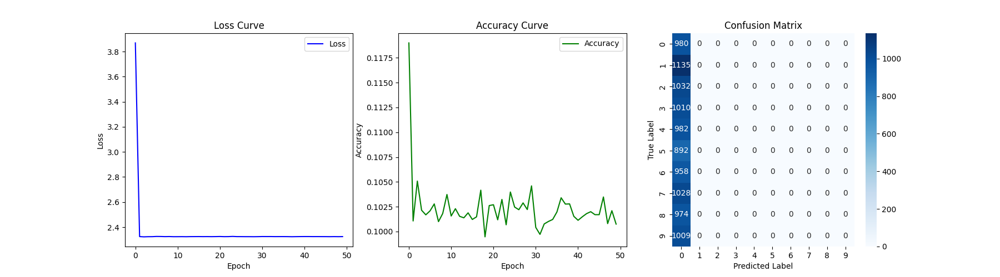     |
| (100, 60)     | 0.1           | 2.3242     | 0.1004         | 0.0974        | 1050.01 sec    | 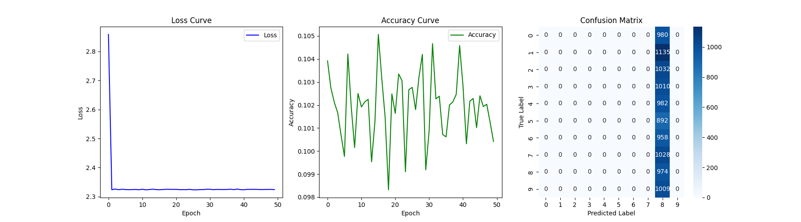       |
| (60, 60)      | 0.1           | 2.3246     | 0.1035         | 0.1010        | 1271.12 sec    | 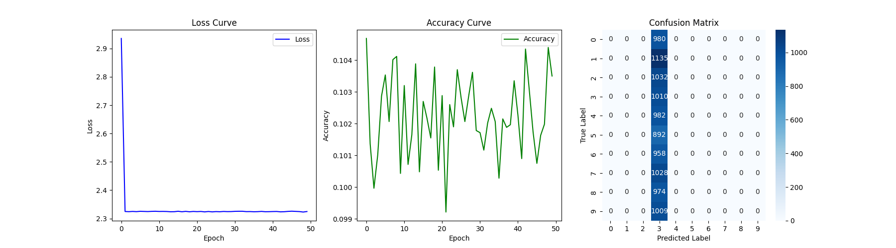       |
| (160, 100)    | 0.01          | 1.1153     | 0.6894         | 0.7075        | 1019.80 sec    | 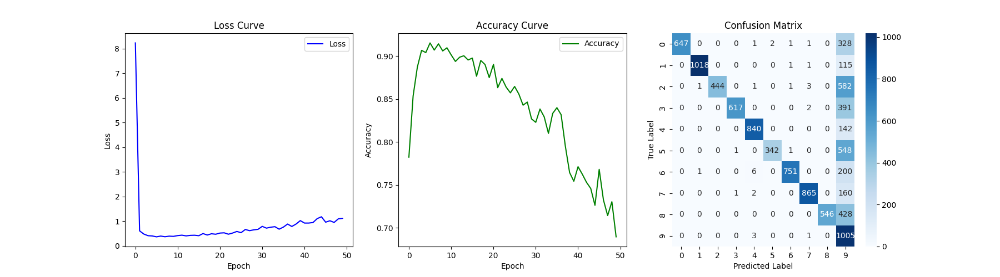   |
| (100, 160)    | 0.01          | 0.5431     | 0.8557         | 0.8853        | 1355.39 sec    | 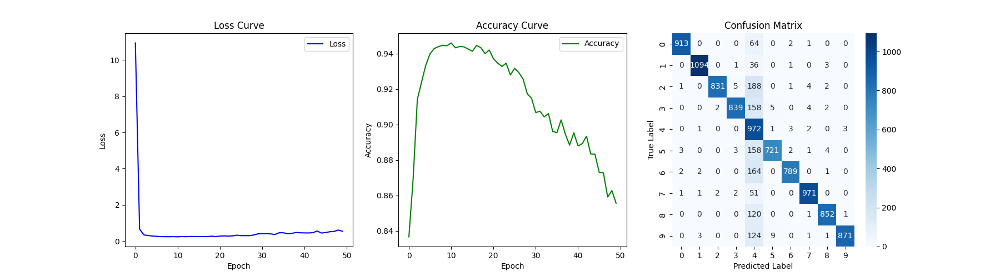   |
| (100, 100)    | 0.01          | 0.8593     | 0.7889         | 0.7887        | 1146.09 sec    | 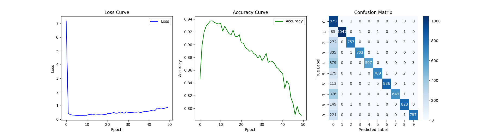   |
| (100, 60)     | 0.01          | 0.8945     | 0.7879         | 0.7417        | 1020.11 sec    | 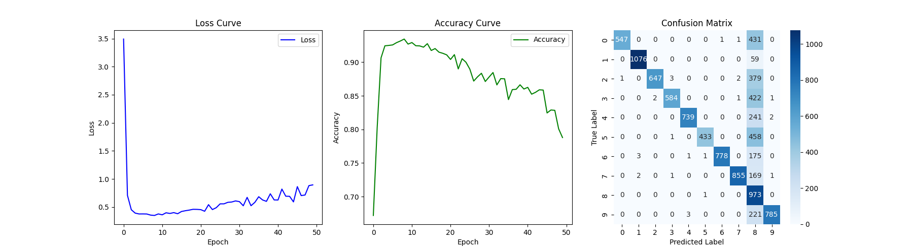    |
| (60, 60)      | 0.01          | 0.3817     | 0.9160         | 0.9121        | 1322.09 sec    | 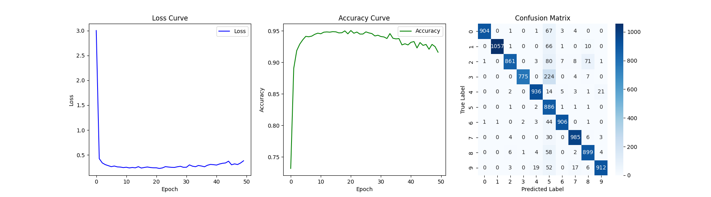     |
| (160, 100)    | 0.001         | 0.0704     | 0.9965         | 0.9689        | 1041.14 sec    |  |
| (100, 160)    | 0.001         | 0.0974     | 0.9963         | 0.9635        | 1356.72 sec    |  |
| (100, 100)    | 0.001         | 0.0610     | 0.9955         | 0.9652        | 1146.62 sec    |  |
| (100, 60)     | 0.001         | 0.0204     | 0.9949         | 0.9633        | 1028.77 sec    | 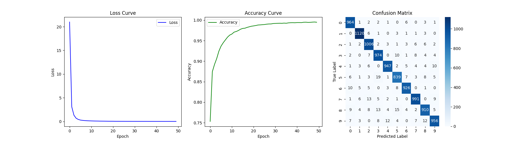  |
| (60, 60)      | 0.001         | 0.0243     | 0.9937         | 0.9568        | 1326.18 sec    |    |
